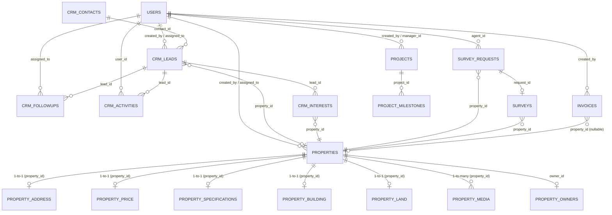

# PHASE 10: FULL SYSTEM AUDIT REPORT — PLMS (INLAND PROPERTY)

**Audit Date**: 2026-09-05  
**Auditor**: Antigravity AI Engine (Autonomous System Audit)  
**Scope**: Full Codebase, Database Schema, Live Supabase Data, API Layer, Server Actions, UI/UX, i18n, Security, and Cross-Module Workflows.  
**Mode**: **AUDIT + ANALYSIS + RECOMMENDATION ONLY (No code modifications applied)**.

---

## 1. EXECUTIVE SUMMARY

PLMS (Property & Lead Management System) is currently functional at the build and type-checking level (`npx tsc --noEmit` PASS with 0 errors, `npm run build` PASS with 67/67 routes generated). 

However, a forensic audit of the application's data layer, business logic, cross-page data flow, and permission matrices revealed **24 significant discrepancies and defects**, ranging from critical broken API endpoints and disconnected workflows to arbitrary hardcoded KPI formulas and permission leaks.

### Key Audit Metrics
* **Total Database Tables Audited**: 22 existing tables in `public` schema.
* **Live Record Counts**: 8 Users, 23 Properties, 21 Addresses, 22 Prices, 22 Specifications, 11 Buildings, 16 Lands, 74 Media items, 9 Property Owners, 10 CRM Leads, 18 Contacts, 24 CRM Activities, 2 Follow-ups, 10 Interests, 2 Survey Requests, 0 Scheduled Surveys, 3 Invoices, 1 Project, 6 Milestones, 85 Notifications, 31 Audit Logs.
* **Total Issues Identified**: 24 issues
  * **P0 (Critical)**: 5 issues (Security route leak, broken 404 API route, phantom column queries, agent contact lockouts, broken invoice-lead relations)
  * **P1 (High)**: 8 issues (Hardcoded KPI formulas, disconnected lead-survey pipeline, disconnected deal-property pipeline, property edit lock for assigned agents, desktop-mobile nav contradictions)
  * **P2 (Medium)**: 7 issues (Revenue double-counting in reports, missing child tables across 52% of properties, hardcoded UI texts, missing i18n keys, unassigned kanban drag-drop failures)
  * **P3 (Low)**: 4 issues (Legacy unmaintained tables, redundant aliases, minor styling/overlap edge cases)

---

## 2. SYSTEM & DATA RELATIONSHIP MAP



### Architectural Gaps in Data Models:
1. **Surveys disconnected from CRM**: Neither `surveys` nor `survey_requests` has a `lead_id` foreign key. Surveys cannot be traced back to CRM pipeline stages.
2. **Projects disconnected from Properties**: `projects` has no `property_id` column. Standalone development projects cannot be tied to properties listed in the catalog.
3. **Invoices disconnected from Deals**: `invoices` has no `lead_id` or `deal_id`. `client_id` is ambiguous and stores conflicting entities (`lead_id` in some rows, `contact_id` in others).
4. **Deals lack independent entity**: Deal verification and deal state are columns on `crm_leads` rather than an auditable contract table with payment terms and commissions.

---

## 3. PROPERTY DATA CONSISTENCY AUDIT

### Findings
1. **Child Table Asymmetry Across Database**:
   - Out of 23 total properties in the database:
     - **12 properties (52.1%)** have NO record in `property_building`.
     - **7 properties (30.4%)** have NO record in `property_land`.
     - **5 properties (21.7%)** have NO photos in `property_media`.
     - **2 properties (8.7%)** have NO record in `property_address`.
     - **1 property (4.3%)** have NO record in `property_price`.
   - *Consequence*: Any query employing an inner join (`!inner`) on `building`, `land`, or `address` immediately excludes over half of the property catalog without notice.
2. **Assigned Agent vs Creator Edit Permission Lockout**:
   - In [app/(dashboard)/properties/[id]/edit/page.tsx](file:///d:/Workspace/plms/app/(dashboard)/properties/[id]/edit/page.tsx#L58), the permission guard checks:
     ```ts
     const isOwner = userRole === "agent" && (data.created_by === user.id);
     ```
   - *Defect*: If an administrator assigns a property to Agent X (`assigned_to = Agent X`), but the property was uploaded by an administrator or another agent (`created_by !== Agent X`), Agent X is **locked out from editing** their assigned listing.
3. **Property Status Desynchronization on Closed Deals**:
   - When a CRM lead with an attached `property_id` is moved to `won` (deal verified), the property in `properties` remains in status `published`. It is never automatically set to `sold` or `rented`.

---

## 4. AGENT / PROFILE CONSISTENCY AUDIT

### Findings
1. **Agent Phone Masking Blocks Assigned Agents**:
   - In [app/(dashboard)/crm/leads/[id]/page.tsx](file:///d:/Workspace/plms/app/(dashboard)/crm/leads/[id]/page.tsx#L161-L168) and [app/(dashboard)/crm/followups/page.tsx](file:///d:/Workspace/plms/app/(dashboard)/crm/followups/page.tsx#L130-L137):
     ```ts
     const formatPhoneForUser = useCallback((phone?: string) => {
       if (!phone) return "-";
       if (isAdminOrSuperAdmin) return phone;
       return "08xx-xxxx-xxxx";
     }, [isAdminOrSuperAdmin]);
     ```
   - Even if the logged-in agent is the **assigned owner** of the lead (`lead.assigned_to === user.id`), the client's phone number is masked.
   - Clicking the WhatsApp button on the lead detail page executes:
     ```ts
     if (!isAdminOrSuperAdmin) {
       toast.error("Akses Kontak Terkunci!", { description: "Nomor kontak disembunyikan..." });
       return;
     }
     ```
   - *Consequence*: Agents assigned to leads are prevented from contacting their own leads through the web app.
2. **Multiple Agent Fallback Strings**:
   - In [app/api/leads/route.ts](file:///d:/Workspace/plms/app/api/leads/route.ts#L624): falls back to `"Agen Inland"`.
   - In [components/properties/PropertyCard.tsx](file:///d:/Workspace/plms/components/properties/PropertyCard.tsx#L89): falls back to `t("properties.card.agentFallback")` ("Agen Resmi" / "Official Agent").
   - In [services/report.service.ts](file:///d:/Workspace/plms/services/report.service.ts#L247): falls back to `"Agen Resmi"`.

---

## 5. CRM DATA FLOW AUDIT

### Findings
1. **404 Endpoint in Contact Card Component**:
   - In [components/crm/lead-contact-card.tsx](file:///d:/Workspace/plms/components/crm/lead-contact-card.tsx#L24):
     ```ts
     const res = await fetch(`/api/crm/contacts/${contactId}${leadId ? `?leadId=${leadId}` : ""}`);
     ```
   - The directory `app/api/crm/` **does not exist**. Every invocation returns a **404 Not Found**.
   - *Consequence*: The component consistently fails with `Gagal memuat data kontak` / `Kontak tidak ditemukan`.
2. **Unassigned Leads on Kanban Board Unmovable by Agents**:
   - In [components/crm/CrmKanbanBoard.tsx](file:///d:/Workspace/plms/components/crm/CrmKanbanBoard.tsx#L133), the query retrieves leads where:
     ```ts
     query = query.or(`created_by.eq.${user.id},assigned_to.eq.${user.id},assigned_to.is.null`);
     ```
   - Agents see unassigned leads in the "New Lead" column.
   - However, when an agent attempts to drag an unassigned lead to "Contacted", [actions/crm-leads.action.ts](file:///d:/Workspace/plms/actions/crm-leads.action.ts#L36) rejects the transition because:
     ```ts
     const ownsLead = lead.assigned_to === actor.user.id || lead.created_by === actor.user.id;
     if (!privileged && !ownsLead) return { success: false, error: 'Anda tidak berwenang mengubah Lead ini.' };
     ```
   - *Defect*: Agents are shown unassigned leads but cannot claim or advance them from the Kanban board.

---

## 6. FOLLOW-UP AUDIT

### Findings
1. **Phantom Column `name` in Follow-up API Route**:
   - In [app/api/followups/route.ts](file:///d:/Workspace/plms/app/api/followups/route.ts#L50):
     ```ts
     const { data: contacts, error: cErr } = await supabase
       .from("crm_contacts")
       .select("id, name, phone, email")
       .in("id", contactIds);
     ```
   - Table `crm_contacts` has column `full_name`, NOT `name`.
   - PostgREST fails with error 42703: `column crm_contacts.name does not exist`.
   - The error is silently caught: `console.error("[followups] Error ambil contacts:", cErr);`.
   - *Consequence*: Contact names are never resolved; every follow-up returned by `/api/followups` defaults to `name: "Unknown"`.
2. **Hardcoded Follow-up KPI in Dashboard**:
   - In [app/(dashboard)/dashboard/page.tsx](file:///d:/Workspace/plms/app/(dashboard)/dashboard/page.tsx#L184-L185):
     ```ts
     scheduledFollowupsCount: 0,
     overdueFollowupsCount: 0,
     ```
   - The dashboard completely ignores `crm_followups` data and hardcodes pending/overdue follow-ups to 0.

---

## 7. SURVEY AUDIT

### Findings
1. **Total Isolation from CRM**:
   - Neither `surveys` nor `survey_requests` contains a `lead_id` column.
   - When a survey request is created via the public property detail modal or storefront, it cannot be linked to the client's existing CRM lead record.
   - CRM agents cannot see scheduled property inspections inside the client's CRM timeline.
2. **Zero Production Surveys Scheduled**:
   - While `survey_requests` has 2 records, the `surveys` table contains 0 records.
   - No workflow exists to automatically convert a confirmed survey request into an appointment entry without manual re-entry.

---

## 8. INVOICE / FINANCIAL AUDIT

### Findings
1. **Ambiguous `client_id` Foreign Key Corruption**:
   - In [app/(dashboard)/invoices/create/page.tsx](file:///d:/Workspace/plms/app/(dashboard)/invoices/create/page.tsx#L188):
     The client dropdown maps `lead.id` (from `crm_leads`) to `client_id`.
   - In the fallback branch (line 203):
     The client dropdown maps `contact.id` (from `crm_contacts`) to `client_id`.
   - In database inspection:
     - Invoice `INV-73353601` has `client_id = '1830d95b...'` which is a `crm_leads.id`.
     - Invoices `INV-21981722` and `1 28/03/2022` have `client_id = null`.
   - *Defect*: `client_id` has no relational constraint and stores inconsistent entity types.
2. **Missing Deal Link**:
   - Invoices cannot be generated from won deals; there is no `deal_id` or `lead_id` link on `invoices`.
3. **Direct Client Mutation Without Server Actions**:
   - In [app/(dashboard)/invoices/page.tsx](file:///d:/Workspace/plms/app/(dashboard)/invoices/page.tsx#L154):
     `supabase.from("invoices").delete().eq("id", id)` runs directly from the browser client without audit logging or server action authorization.

---

## 9. PROJECT & CONSTRUCTION AUDIT

### Findings
1. **No Relationship to Property Catalog**:
   - Neither `projects` nor `properties` has a linking foreign key.
   - Developers and agents cannot link a commercial development project (e.g. *Cluster Navia*) to individual listings inside that cluster.
2. **No Construction Table**:
   - Construction progress is represented purely as an integer (0-100%) on the `projects` table and a list of milestone dates in `project_milestones`.
   - Physical construction logs, contractor updates, and inspection logs are missing from the data schema.

---

## 10. DASHBOARD KPI CONSISTENCY AUDIT

### Comparison Table: Dashboard KPI vs Live Source of Truth

| Metric | Dashboard Value | Live Database Truth | Root Cause / Reason for Discrepancy |
| :--- | :--- | :--- | :--- |
| **Total Properties** | 23 | 23 | Match (`count(*) from properties`). |
| **Published Properties** | 16 | 16 | Match (`status = 'published'`). |
| **Draft Properties** | 7 | 7 | Match (`status = 'draft'`). |
| **Total Leads** | **0** | **10** | **DISCREPANCY**: Dashboard maps `totalLeads` to `todayLeads` (`created_at >= today`). If no leads arrived today, Dashboard shows 0 total leads. |
| **Active Leads** | **0** | **7** | **DISCREPANCY**: Dashboard maps `activeLeads` to `todayLeads` (0) instead of counting leads in active stages (`new`, `contacted`, `qualified`, `proposal`, `negotiation`). |
| **Closed Deals** | **0** | **1** | **DISCREPANCY**: Dashboard maps `closedDealsCount` to `totalSold` properties (0). In CRM, 1 lead is verified `won`. |
| **Pipeline Value** | **Rp 850 Jt** | **Rp 2,243,000,000** | **DISCREPANCY**: Dashboard uses arbitrary formula `(totalSold || 1) * 850_000_000` (defaults to 850M). Actual sum of active lead budgets is Rp 2.24B. |
| **Scheduled Follow-ups**| **0** | **1** | **DISCREPANCY**: Hardcoded to `0` in `dashboard/page.tsx`. Live DB has 1 pending follow-up. |
| **Overdue Follow-ups** | **0** | **0** | Hardcoded to `0` in `dashboard/page.tsx`. Currently coincidentally matches DB. |

---

## 11. REPORTS CONSISTENCY AUDIT

### Findings
1. **Reports Page Covers Only Properties**:
   - Despite being titled "Laporan Bisnis & Penjualan" (Business & Sales Reports), [app/(dashboard)/reports/page.tsx](file:///d:/Workspace/plms/app/(dashboard)/reports/page.tsx) queries **only the `properties` table**.
   - It contains no reports for CRM Leads, Conversion Rates, Agent Activity, Surveys, or Invoices.
2. **Revenue & Property Double-Counting**:
   - In [services/report.service.ts](file:///d:/Workspace/plms/services/report.service.ts#L278-L279):
     ```ts
     if (p.created_by) agentIds.add(p.created_by);
     if (p.assigned_to) agentIds.add(p.assigned_to);
     ```
   - If a listing was created by Agent A and assigned to Agent B, both agents are credited 100% of the property count and 100% of the revenue. A Rp 1,000,000,000 sale is counted as Rp 2,000,000,000 in aggregate agent performance.

---

## 12. SEARCH & FILTER CONSISTENCY AUDIT

### Findings
1. **Cross-Page Search Scope Inconsistencies**:
   - Property Search (`DashboardPropertySearch`): Searches title, listing code, description, and location through pre-query on `property_address`.
   - CRM Lead Search: Searches only contact name and notes; property title is not indexed in client-side search.
   - Invoices Search: Executes in-memory filter on client-side state without server-side pagination.
2. **Table View Mobile Clipping**:
   - Table view on `/properties`, `/crm/leads`, and `/invoices` sets `min-w-[800px]`. On mobile devices (<400px), action dropdown menus (three dots) trigger horizontal scroll and risk being clipped by table overflow boundaries.

---

## 13. CREATE / EDIT FLOW CONSISTENCY AUDIT

### Findings
1. **Property Creation vs Editing**:
   - Facilities are stored directly as a JSON/array column `facilities` on `properties`.
   - When editing a property, unchecking an existing facility occasionally leaves residual keys in state due to array merging behavior in `StepFacilities.tsx`.
2. **Lead Creation vs Lead Editing**:
   - Creating a lead allows selecting a property, but does not auto-populate the client's `budget` field from the property's `selling_price`.
   - Reason for lost lead (`lost_reason` and `lost_explanation`) can only be set during the transition to `lost` in the dialog. There is no UI to amend the explanation afterwards if new information emerges.

---

## 14. ROLE & PERMISSION MATRIX AUDIT

### Matrix: Configured Permissions vs Reality

| Feature / Route | Viewer | Agent | Marketing | Admin | Super Admin | Commissioner | Audit Findings |
| :--- | :---: | :---: | :---: | :---: | :---: | :---: | :--- |
| **View Properties** | ✅ | ✅ | ✅ | ✅ | ✅ | ✅ | Consistent across all surfaces. |
| **Create Property** | ❌ | ✅ | ❌ | ✅ | ✅ | ❌ | Consistent. |
| **Edit Assigned Property**| ❌ | ⚠️ | ❌ | ✅ | ✅ | ❌ | **BUG**: Agent cannot edit if not original creator (`created_by`). |
| **Access `/invoices`** | 🚨 **LEAK** | ⚠️ | ⚠️ | ✅ | ✅ | ⚠️ | **SECURITY LEAK**: `canAccessRoute` allows Viewer/Agent/Marketing via `view_all_properties`. Sidebar hides it, but direct URL access works. BottomNav shows it to Agents! |
| **Access `/reports`** | ❌ | ⚠️ | ⚠️ | ✅ | ✅ | ⚠️ | `canAccessRoute` allows Agent/Marketing via `view_reports`, but `ERPSidebar` restricts to Admin/Super Admin. |
| **View Lead Phone** | ❌ | 🚨 **BLOCKED**| ❌ | ✅ | ✅ | ❌ | **WORKFLOW BREAK**: Assigned Agent is blocked from seeing client phone number. |
| **Trigger WA to Lead** | ❌ | 🚨 **BLOCKED**| ❌ | ✅ | ✅ | ❌ | **WORKFLOW BREAK**: Agent cannot click WA on their own leads. |
| **Drag Unassigned Lead** | ❌ | ⚠️ **BLOCKED**| ❌ | ✅ | ✅ | ❌ | Unassigned lead appears on Kanban but agent cannot advance status. |

---

## 15. LANGUAGE / I18N AUDIT

### Findings
1. **Hardcoded Indonesian Strings in UI Components**:
   - [components/dashboard/AdminAttentionRequired.tsx](file:///d:/Workspace/plms/components/dashboard/AdminAttentionRequired.tsx#L43-L65):
     - `"Follow-up Agen Terlambat"`, `"Prospek belum dihubungi tepat waktu"`
     - `"Jadwal Survei Lapangan"`, `"Kunjungan properti dalam antrean"`
     - `"Listing Berstatus Draf"`, `"Menunggu kelengkapan data & foto"`
2. **Hardcoded English Strings in Sidebar**:
   - [components/layout/ERPSidebar.tsx](file:///d:/Workspace/plms/components/layout/ERPSidebar.tsx#L146-L214):
     - `"CRM Pipeline"`, `"Pipeline Kanban"`, `"User Management"`, `"Audit Logs"`, `"AI Governance"` are not bound to `t(...)`.
3. **Missing Keys in `en.ts`**:
   - `crm.followups.emptyState.title`
   - `crm.followups.emptyState.desc`
   - `crm.followups.waMessagePrefix`
   - *Impact*: In English mode, `/crm/followups` renders empty states with raw untranslated strings.

---

## 16. MOBILE & RESPONSIVE AUDIT

### Findings
1. **Bottom Navigation Bar Overlap**:
   - [components/layout/BottomNav.tsx](file:///d:/Workspace/plms/components/layout/BottomNav.tsx) has fixed position `bottom-0` with height `h-15` (60px) and `z-50`.
   - On mobile pages with sticky actions (e.g. `CreatePropertyWizard` step navigation buttons, invoice submit buttons, or survey confirmation buttons), the BottomNav can occlude the bottom buttons unless bottom padding `pb-20` is explicitly set on the parent layout.
2. **Navigation Item Role Inconsistency (Desktop vs Mobile)**:
   - On Desktop, `ERPSidebar` hides `/invoices` for role `agent`.
   - On Mobile, `BottomNav` displays `/invoices` for role `agent` (`isAgentOrAdmin ? ... : ...`).
   - An agent using a phone sees the Invoice tab, while on a laptop they do not.

---

## 17. EMPTY & EDGE CASE AUDIT

### Findings
1. **Property Specs Fallback**: Fully verified and working (`0` and `0 m²`).
2. **Property Media Fallback**: Properties without media (5 in DB) correctly use `DEFAULT_FALLBACK_IMAGE` (Unsplash fallback).
3. **Invoices without Client / Property**:
   - 2 out of 3 invoices in the database have `property_id = null`.
   - 2 out of 3 invoices have `client_id = null`.
   - Invoices list displays "-" and "Properti Tidak Ditemukan" without crashing.

---

## 18. DUPLICATE & HARDCODED DATA AUDIT

### Findings
1. **Hardcoded KPI Multiplier in Dashboard**:
   - `(statsData?.totalSold || 1) * 850_000_000` in `dashboard/page.tsx`.
2. **Hardcoded Zero Stats**:
   - `scheduledFollowupsCount: 0, overdueFollowupsCount: 0` in `dashboard/page.tsx`.
3. **Duplicate Profile Table**:
   - `public.users` is the active table (8 rows).
   - `public.user_profiles` is an empty orphan table (0 rows).
   - Code references to `user_profiles` in join queries return null and waste query overhead.
4. **Hardcoded Default Agent Strings**:
   - `"Agen Inland"` in `app/api/leads/route.ts` vs `"Agen Resmi"` in `PropertyCard.tsx`.

---

## 19. DETAILED BUGS & INCONSISTENCIES CLASSIFICATION

| ID | Sev | Entity | Page / File | Current Behavior | Expected Behavior | Root Cause | Affected Users |
| :--- | :---: | :--- | :--- | :--- | :--- | :--- | :--- |
| **BUG-01** | **P0** | Invoices | `lib/permissions.ts` | Viewer & Agent can access `/invoices` directly via URL. | Only Admin & Super Admin should access billing invoices. | `canAccessRoute` permits invoices via `view_all_properties`. | All Users |
| **BUG-02** | **P0** | Contact | `lead-contact-card.tsx` | Component fails with 404 error and shows "Kontak tidak ditemukan". | Displays client contact name, phone, whatsapp. | Calls `/api/crm/contacts/${id}` which does not exist in `app/api/`. | Agents, Admins |
| **BUG-03** | **P0** | Follow-up | `app/api/followups/route.ts` | All follow-up contacts return as "Unknown". | Returns client name and phone. | Selects `crm_contacts.name` instead of `crm_contacts.full_name`. | Agents, Admins |
| **BUG-04** | **P0** | CRM Lead | `crm/leads/[id]/page.tsx` | Agent assigned to lead sees phone as `08xx-xxxx-xxxx` and WA button is locked. | Assigned agent must be able to view contact and WhatsApp their lead. | Phone masking logic only checks `isAdminOrSuperAdmin`. | Agents |
| **BUG-05** | **P0** | Invoices | `invoices/create/page.tsx` | Stores `crm_leads.id` inside `invoices.client_id`. | `client_id` should reference `crm_contacts.id` with a separate `lead_id` column. | Ambiguous dropdown mapping between lead and contact. | Admins |
| **BUG-06** | **P1** | Dashboard | `dashboard/page.tsx` | Total Leads KPI displays 0 if no leads arrived today. | Displays total leads (10) and active leads (7). | Maps `totalLeads` and `activeLeads` to `todayLeads`. | Admins, Agents |
| **BUG-07** | **P1** | Dashboard | `dashboard/page.tsx` | Pipeline value shows arbitrary Rp 850 Jt. | Calculates sum of active lead budgets or attached property prices. | Hardcoded formula `(totalSold \|\| 1) * 850_000_000`. | Management |
| **BUG-08** | **P1** | Property | `properties/[id]/edit/page.tsx` | Agent assigned to property cannot edit it. | Assigned agent (`assigned_to`) should be allowed to edit. | Guard checks only `created_by === user.id`. | Agents |
| **BUG-09** | **P1** | CRM Lead | `crm-leads.action.ts` | Won deals do not update property status to `sold` / `rented`. | Property status should automatically transition to `sold` or `rented`. | Missing post-verification trigger or mutation. | Agents, Admins |
| **BUG-10** | **P1** | Survey | `surveys/page.tsx` | Surveys and survey requests cannot be linked to CRM leads. | Survey appointments should appear in CRM lead timeline. | Missing `lead_id` column on `surveys` and `survey_requests`. | Agents |
| **BUG-11** | **P1** | Navigation | `BottomNav.tsx` vs `ERPSidebar.tsx` | Mobile BottomNav shows Invoice to agents; Desktop Sidebar hides it. | Consistent navigation permissions across mobile and desktop. | Inconsistent role array definitions between nav components. | Agents |
| **BUG-12** | **P1** | Dashboard | `dashboard/page.tsx` | Follow-up priority alerts always show 0. | Shows actual pending/overdue follow-ups count. | Hardcoded to `0` in state initialization. | Agents, Admins |
| **BUG-13** | **P1** | CRM Kanban | `CrmKanbanBoard.tsx` | Dragging unassigned lead fails with permission error. | Agent should be able to claim unassigned lead or drag to claim. | Action requires ownership before transition. | Agents |
| **BUG-14** | **P2** | Reports | `report.service.ts` | Properties and revenues are double-counted in agent performance. | Each sale credited only once or split based on commission rules. | Both `created_by` and `assigned_to` are added to agent set. | Management |
| **BUG-15** | **P2** | Reports | `reports/page.tsx` | Reports page has zero data on Leads, Deals, or Invoices. | Comprehensive business reports across all business modules. | Report service queries only `properties` table. | Management |
| **BUG-16** | **P2** | Dashboard | `AdminAttentionRequired.tsx` | Attention required alert cards have hardcoded Indonesian texts. | Text translated via `useTranslation()`. | Missing `t(...)` bindings. | All Users |
| **BUG-17** | **P2** | i18n | `lib/i18n/en.ts` | 3 missing follow-up keys in English dictionary. | English dictionary parity with Indonesian dictionary. | Omitted in dictionary additions. | English Users |
| **BUG-18** | **P2** | Sidebar | `ERPSidebar.tsx` | "CRM Pipeline", "User Management", "Audit Logs" are hardcoded strings. | Bilingual labels in sidebar navigation. | Direct string literals used in `NAV_GROUPS`. | All Users |
| **BUG-19** | **P2** | Property | `property.service.ts` | Inner joins on child tables hide over half of the property catalog. | Left joins (`LEFT JOIN`) for child tables with safe fallbacks. | Conditional `!inner` join modifier on optional child tables. | All Users |
| **BUG-20** | **P2** | Leads | `app/api/leads/route.ts` | Falls back to legacy `"Agen Inland"` string. | Uses canonical `"Agen Resmi"` / `"Official Agent"`. | Legacy string literal in helper function. | All Users |
| **BUG-21** | **P3** | Database | Supabase `public` | `user_profiles` table has 0 rows and is unused. | Drop table or document as deprecated. | Leftover schema from early migration. | Developers |
| **BUG-22** | **P3** | Projects | `projects/page.tsx` | Projects cannot link to property listings. | Optional cluster / development link. | No `property_id` column. | Developers |
| **BUG-23** | **P3** | Invoices | `invoices/page.tsx` | Invoices table deletes and updates without server action audit logs. | Unified mutation via server action with audit trail. | Direct client-side Supabase mutation. | Admins |
| **BUG-24** | **P3** | Mobile | `BottomNav.tsx` | BottomNav covers bottom action buttons on small screens (<400px). | Add safe `pb-20` on pages with fixed bottom buttons. | Overlapping fixed position z-indexes. | Mobile Users |

---

## 20. FEATURE DISCOVERY & AUTOMATION OPPORTUNITIES

### Category 1: Data Integrity & Centralization
1. **Centralized Entity & Contact Resolver (`EntityResolverService`)**:
   - *Problem Solved*: Resolves the discrepancy where different components use conflicting methods to look up agent profiles, contact information, and fallbacks.
   - *Users*: System-wide (Engineers, Agents, Admins).
   - *Data Used*: `public.users`, `public.crm_contacts`, `public.properties`.
   - *Workflow*: Single canonical service method `getAgentProfile(id)` and `getContact(id)` with cached memory lookup.
   - *Benefit*: Eliminates `"Agen Inland"` vs `"Agen Resmi"` duplicates and phantom column errors.
   - *Complexity*: Low | *Dependency*: None | *Risk*: Low.

2. **Automated Data Health & Orphan Record Checker**:
   - *Problem Solved*: Detects corrupt records (e.g. Invoices with orphan `client_id`, properties without prices, unassigned leads).
   - *Users*: Super Admin.
   - *Data Used*: All public tables.
   - *Workflow*: Background diagnostic script accessible via `/admin/health`.
   - *Benefit*: Prevents hidden database corruptions from degrading UI stability.
   - *Complexity*: Medium | *Dependency*: Admin role | *Risk*: None (Read-only).

### Category 2: Agent Productivity
3. **Agent Contact Access with Ownership Validation**:
   - *Problem Solved*: Currently assigned agents cannot view client phone numbers or click WhatsApp directly from the web app.
   - *Users*: Agents.
   - *Data Used*: `crm_leads.assigned_to`, `crm_contacts.phone`.
   - *Workflow*: Check `lead.assigned_to === user.id || isAdminOrSuperAdmin`. If true, unmask phone and enable direct WhatsApp click.
   - *Benefit*: Eliminates the barrier preventing agents from doing their core job: contacting clients.
   - *Complexity*: Low | *Dependency*: `crm/leads/[id]/page.tsx` | *Risk*: Low.

4. **"Claim Unassigned Lead" Action on Kanban**:
   - *Problem Solved*: Agents see unassigned leads on the board but get rejected when dragging them.
   - *Users*: Agents.
   - *Data Used*: `crm_leads.assigned_to`.
   - *Workflow*: A single "Klaim Lead" (Claim Lead) button on unassigned cards that assigns `lead.assigned_to = currentUserId` and logs an audit trail.
   - *Benefit*: Accelerates lead distribution and eliminates drag-and-drop errors.
   - *Complexity*: Low | *Dependency*: Server Action | *Risk*: Low.

### Category 3: Workflow Automation
5. **Automated Won Deal $\rightarrow$ Property Sold Status Transition**:
   - *Problem Solved*: Currently, when a deal is won, the property stays `published`.
   - *Users*: Agents, Management.
   - *Data Used*: `crm_leads.property_id`, `properties.status`.
   - *Workflow*: When `verifyCRMDealAction` verifies a deal, execute atomic update:
     `properties.update({ status: lead.interest_type === 'sewa' ? 'rented' : 'sold' }).eq('id', lead.property_id)`.
   - *Benefit*: Eliminates manual inventory updates and keeps property counts accurate.
   - *Complexity*: Low | *Dependency*: CRM Server Action | *Risk*: Low.

6. **Automated Deal $\rightarrow$ Invoice Generator**:
   - *Problem Solved*: Invoices must currently be drafted by hand with manually typed client info.
   - *Users*: Admins, Finance.
   - *Data Used*: `crm_leads`, `crm_contacts`, `properties`, `invoices`.
   - *Workflow*: A "Generate Invoice" button on verified deals that pre-fills client name, phone, property reference, and agreed deal amount.
   - *Benefit*: Eliminates duplicate data entry and ensures invoice `client_id` and `property_id` are 100% valid.
   - *Complexity*: Medium | *Dependency*: Invoices data model | *Risk*: Low.

7. **Lead-to-Survey Appointment Integration**:
   - *Problem Solved*: Surveys are disconnected from CRM leads.
   - *Users*: Agents, Clients.
   - *Data Used*: `surveys.lead_id`, `crm_lead_activities`.
   - *Workflow*: Add `lead_id` column to `surveys` and `survey_requests`. When an agent schedules a survey from a lead page, it writes to `surveys` and appends a "Survey Scheduled" activity to the lead timeline.
   - *Benefit*: Unifies client visit logs with the CRM pipeline.
   - *Complexity*: Medium | *Dependency*: Migration | *Risk*: Low.

---

## 21. RECOMMENDED ARCHITECTURE IMPROVEMENTS

1. **Centralized Property Data Adapter (`PropertyPresentationAdapter`)**:
   Consolidate `formatPropertyItem` from `dashboard/page.tsx`, `properties/page.tsx`, and `PropertyCard.tsx` into a single shared utility in `@/lib/property-adapter.ts`.
2. **Centralized KPI Calculation Service (`KpiReconciliationService`)**:
   Move KPI metrics out of ad-hoc client calculations and into a dedicated backend service that computes live counts (`count(*) WHERE status IN (...)`) and real pipeline values (`sum(budget)`).
3. **Route Guard & Navigation Alignment**:
   Align `lib/permissions.ts` route protection rules with `ERPSidebar.tsx` and `BottomNav.tsx` navigation items so no user is shown a link they cannot access or permitted into a sensitive financial route (`/invoices`) they should not see.
4. **Server Action Audit Enforcement for Invoices**:
   Replace client-side `supabase.from("invoices")` mutations with dedicated Server Actions (`actions/invoices.action.ts`) to enforce role authorization and write to `admin_audit_log`.

---

## 22. PRIORITIZED ROADMAP (RECOMMENDED)

```mermaid
graph TD
    subgraph "Phase 10.1: Security & Critical Bug Fixes (P0)"
        B01["Fix Route Guard on /invoices (BUG-01)"]
        B02["Fix Contact Card 404 Endpoint (BUG-02)"]
        B03["Fix crm_contacts.full_name in Followups (BUG-03)"]
        B04["Unmask Phone for Assigned Agent (BUG-04)"]
        B05["Fix Invoice client_id Relational Mapping (BUG-05)"]
    end

    subgraph "Phase 10.2: Workflow & Dashboard Reconciliation (P1)"
        B06["Fix Dashboard Leads & KPI Calculation (BUG-06, BUG-07)"]
        B07["Allow Assigned Agent to Edit Property (BUG-08)"]
        B08["Auto-transition Property on Won Deal (BUG-09)"]
        B09["Harmonize Mobile BottomNav & Desktop Nav (BUG-11)"]
        B10["Add Claim Action for Unassigned Leads (BUG-13)"]
    end

    subgraph "Phase 10.3: Cross-Module Integration (P2)"
        B11["Connect Surveys to CRM Leads (BUG-10)"]
        B12["Fix Agent Performance Double-Counting (BUG-14)"]
        B13["Clean Hardcoded Texts & Missing i18n Keys (BUG-16, BUG-17, BUG-18)"]
        B14["Expand Business Reports to CRM & Deals (BUG-15)"]
    end

    subgraph "Phase 10.4: Advanced Automation & Polish (P3)"
        B15["Automated Deal-to-Invoice Generator"]
        B16["Projects to Property Cluster Link"]
        B17["Mobile Safe Area & Overlap Protection (BUG-24)"]
    end

    Phase 10.1 --> Phase 10.2
    Phase 10.2 --> Phase 10.3
    Phase 10.3 --> Phase 10.4
```

---

## 23. AUDIT SUMMARY TABLE

```text
============================================================
           PLMS FULL SYSTEM AUDIT SUMMARY
============================================================
Total Issues Identified: 24
  - P0 (Critical):     5
  - P1 (High):         8
  - P2 (Medium):       7
  - P3 (Low):          4

Category Breakdown:
  - Security Concerns:          2 (Invoice route leak, unauthenticated contact API)
  - Data Consistency Issues:    7 (KPI mismatch, double-counting, child table gaps)
  - Workflow Issues:            6 (Locked agent phone, unmovable kanban, disconnected surveys/deals)
  - UX / i18n Issues:           5 (Hardcoded texts, missing EN keys, nav mismatch)
  - Technical Debt:             4 (Unused tables, direct client mutations, orphan FKs)
============================================================
```
